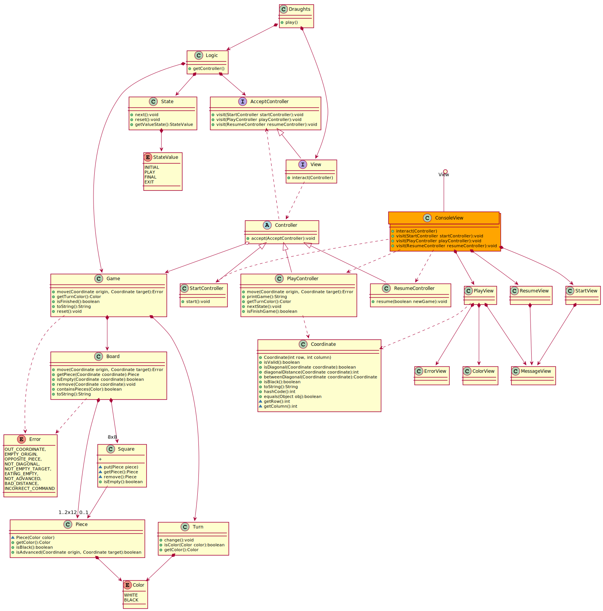

## 4954-PruebasSoftware-Practica6
### Practica 6
* Fecha de entrega: 04/11/2019
* Integrantes:
  * Neo Koutsourais


## Diagrama Damas

<p align="center">
  
</p>

### PlantUML
 
 ```PlantUML
@startuml

class Draughts {
+ play()
}
Draughts *-down-> Logic
Draughts *-down-> View

interface View {
+ interact(Controller)
}

class ConsoleView #orange {
+ interact(Controller)
+ visit(StartController startController):void 
+ visit(PlayController playController):void 
+ visit(ResumeController resumeController):void 
}

View ()-- ConsoleView
ConsoleView ..> StartController
ConsoleView ..> PlayController
ConsoleView ..> ResumeController

class StartView {
}
StartView *-down-> MessageView

class PlayView {
}
PlayView *-down-> ColorView
PlayView *-down-> ErrorView
PlayView *-down-> MessageView

class ResumeView {
}
ResumeView *-down-> MessageView

ConsoleView *-down-> StartView
ConsoleView *-down-> PlayView
ConsoleView *-down-> ResumeView

View ..> Controller
AcceptController <|-down- View

class Logic{
+ getController()
}

Logic *--> State
Logic *--> Game
Logic *-down-> AcceptController

abstract class Controller{
  + {abstract} accept(AcceptController):void 
}

interface AcceptController{
  + visit(StartController startController):void 
  + visit(PlayController playController):void 
  + visit(ResumeController resumeController):void 
}

Controller ..> AcceptController
Controller <|-down- StartController
Controller <|-down- PlayController
Controller <|-down- ResumeController
Controller o--> Game

class StartController{
 + start():void
}

class ResumeController{
 + resume(boolean newGame):void
}

class PlayController{
  + move(Coordinate origin, Coordinate target):Error
  + printGame():String
  + getTurnColor():Color
  + nextState():void
  + isFinishGame():boolean
}
PlayController ..> Coordinate

PlayView ..> Coordinate

class Coordinate{
  + Coordinate(int row, int column)
  + isValid():boolean
  + isDiagonal(Coordinate coordinate):boolean
  + diagonalDistance(Coordinate coordinate):int
  + betweenDiagonal(Coordinate coordinate):Coordinate
  + isBlack():boolean 
  + toString():String
  + hashCode():int
  + equals(Object obj):boolean
  ~ getRow():int
  ~ getColumn():int
}

class Game{
  + move(Coordinate origin, Coordinate target):Error
  + getTurnColor():Color
  + isFinished():boolean
  + toString():String
  + reset():void
}
Game *-down-> Board
Game *-down-> Turn
Game ..> Error

class Board{
  + move(Coordinate origin, Coordinate target):Error
  + getPiece(Coordinate coordinate):Piece
  + isEmpty(Coordinate coordinate):boolean
  + remove(Coordinate coordinate):void
  + containsPieces(Color):boolean
  + toString():String
}
Board *-down-> "8x8" Square
Board *-down-> "1..2x12" Piece
Board ..> Error

class Square{
  ~ put(Piece piece)
  ~ getPiece():Piece
  ~ remove():Piece
  + isEmpty():boolean
  + 
}
Square  --> "0..1" Piece

class Piece{
  ~ Piece(Color color)
  + getColor():Color 
  + isBlack():boolean
  + isAdvanced(Coordinate origin, Coordinate target):boolean
}
Piece *--> Color 

enum Color{
    WHITE
    BLACK
}

class Turn{
  + change():void
  + isColor(Color color):boolean
  + getColor():Color 
}
Turn *--> Color

class State{
  + next():void
  + reset():void
  + getValueState():StateValue
}
State *--> StateValue

enum StateValue{
  INITIAL
  PLAY
  FINAL
  EXIT
}

enum Error{
  OUT_COORDINATE, 
  EMPTY_ORIGIN, 
  OPPOSITE_PIECE, 
  NOT_DIAGONAL,
  NOT_EMPTY_TARGET, 
  EATING_EMPTY,
  NOT_ADVANCED,
  BAD_DISTANCE, 
  INCORRECT_COMMAND
}

@enduml

 ```